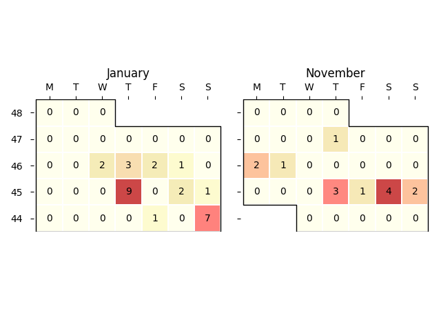

**30** problems are solved for all time!
=========================================

1. ./AtCoder/ABC/267/C.cpp
2. ./CodeForces/bitmasks/1421A.cpp
3. ./CodeForces/bitmasks/1527A.cpp
4. ./CodeForces/bitmasks/1688A.cpp
5. ./CodeForces/bitmasks/1698A.cpp
6. ./CodeForces/Contests/803/1698A.cpp
7. ./CodeForces/Contests/803/1698B.cpp
8. ./CodeForces/Contests/803/1698C.cpp
9. ./CodeForces/Contests/805/1702A.cpp
10. ./CodeForces/Contests/805/1702B.cpp
11. ./CodeForces/Contests/805/1702D.cpp
12. ./CodeForces/graphs/B - Mahmoud and Ehab and the bipartiteness.cpp
13. ./CodeForces/graphs/D - Solve The Maze.cpp
14. ./CSES/DP/Coin Combinations I.cpp
15. ./CSES/DP/Coin Combinations II.cpp
16. ./CSES/DP/Dice Combinations .cpp
17. ./CSES/DP/Minimizing Coins.cpp
18. ./CSES/Graphs/Building Roads.cpp
19. ./CSES/Graphs/Building Teams .cpp
20. ./CSES/Graphs/Counting Rooms.cpp
21. ./CSES/Graphs/Labyrinth.cpp
22. ./CSES/Graphs/Message Route.cpp
23. ./CSES/Tree/Subordinates.cpp
24. ./CSES/Tree/Tree Diameter.cpp
25. ./CSES/Tree/Tree Distances II.cpp
26. ./kick start/2022/practice1/B.cpp
27. ./usaco/graphs/Closing the Farm.cpp
28. ./usaco/graphs/Icy Perimeter.cpp
29. ./usaco/prefix_sum/Breed Counting.cpp
30. ./usaco/prefix_sum/Subsequences Summing to Sevens.cpp
